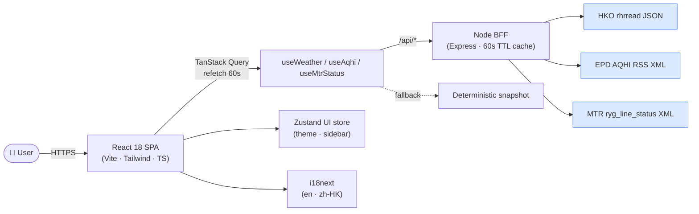

# 🏙️ HK Pulse

> A real-time **Hong Kong open-data dashboard** built as a portfolio piece for
> front-end roles in HK. React 18 · TypeScript · Vite · TanStack Query · Recharts ·
> i18n (繁中 / English) · dark mode · CI + tests.

[](https://github.com/zane-dot/project2/actions/workflows/ci.yml)


---

## 1. Why this project exists

Hong Kong publishes a wealth of high-frequency open data through
[DATA.GOV.HK](https://data.gov.hk) — Observatory weather, EPD air-quality, MTR
service notices — but the official sites are slow, scattered and not optimised
for mobile. **HK Pulse** packages it all into a single, fast, bilingual SPA.

The codebase doubles as a **frontend interview portfolio**: every file is
small, typed end-to-end and demonstrates one concrete frontend competency
(server-state caching, charting, theming, i18n, testing, CI). Each design
choice is defensible in a 45-minute technical interview.

## 2. Features

| Page | What it shows | What it demonstrates |
|---|---|---|
| **Overview** | Live KPIs for temperature, humidity, peak AQHI and active MTR alerts | Composing multiple async queries; conditional tone/colour logic |
| **Weather** | Per-station temperature bar chart + UV & humidity KPIs | Recharts data-viz, sorting via `useMemo`, accessible tooltips |
| **Air Quality** | District cards with AQHI band colouring + filter (general / roadside) | Stateful filtering, derived data, design-token-driven colouring |
| **MTR Status** | Service state per line with brand-coloured badges | List rendering, status enums, badge component pattern |

Bonus:
- 🌗 **Dark mode** (Tailwind `class` strategy, persisted via Zustand)
- 🌐 **i18n** — switch between English and 繁體中文 instantly; browser
  language is auto-detected
- ♻️ **Auto-refresh** every 60 s via TanStack Query `refetchInterval`
- 🛡️ **Offline-safe** — every API client gracefully falls back to
  deterministic data so the dashboard never shows a blank screen (great for
  CI / interview demos with no network)

## 3. Architecture



The browser cannot call the EPD or MTR feeds directly (no CORS). A tiny
Express **Backend-for-Frontend** at `server/` proxies all three upstreams,
adds a 60-second in-memory TTL cache, and wraps the payload in a uniform
envelope so the React clients only ever speak one shape:

```json
{ "ok": true, "cached": false, "ageMs": 0, "data": { ... } }
```

### Folder layout

```
src/                React 18 SPA
  components/       Reusable UI (Layout, KpiCard, AsyncStates, PageHeader)
  pages/            Route-level screens
  lib/api/          One client per data source — calls /api/* with fallback
  lib/hooks.ts      TanStack Query wrappers (refetchInterval = 60s)
  store/ui.ts       Zustand UI store with localStorage persistence
  i18n/             i18next config + locales
server/             Express BFF (ES modules, Node 20+)
  lib/cache.js      TTL cache factory
  lib/weather.js    HKO normaliser
  lib/aqhi.js       EPD RSS parser (fast-xml-parser)
  lib/mtr.js        MTR ryg XML parser
  index.js          Express app + uniform JSON envelope
  __tests__/        node:test suites (parsers + cache)
```

## 4. Frontend depth highlights (interview talking points)

### 4.1 Server-state vs. UI-state, cleanly separated

- **Server state** lives in TanStack Query, with a 60 s `staleTime`, 5-minute
  `gcTime`, and `refetchInterval` for live polling. No Redux thunks.
- **UI state** (theme, sidebar) lives in a small **Zustand** store with
  `persist` middleware writing to `localStorage`. The active theme is
  re-applied on rehydration to avoid a flash of the wrong colour.

### 4.2 Data fetching that survives a hostile network

Every API client returns the same `Snapshot` shape whether the upstream call
succeeded or not. `fetchWeather` for example is `network → parse → fallback`
so the user always gets renderable data and the dashboard is demoable inside
a corporate firewall, on a flight, or in CI. Tests exercise all three
branches (`200`, `5xx`, network throw).

### 4.3 Type-safe charts

Recharts is wrapped behind small typed components so the page code stays
declarative. Colour scales are pure functions (`colorForTemp`,
`bandFor`) — easy to unit-test, no React involved.

### 4.4 Bilingual UI from day one

`react-i18next` with two flat JSON locale files. Numbers and dates use
`Intl` with the active locale so the date in the header switches between
*星期一, 2025年5月1日* and *Monday, May 1, 2025* automatically.

### 4.5 Testing pyramid

| Layer | Tool | What we test |
|---|---|---|
| Pure functions | Vitest | `bandFor`, fallback determinism |
| API clients | Vitest + `fetch` mock | parse path, retry path, fallback path |
| Components | RTL + jsdom | Renders, i18n keys resolve, accessible roles |

`vitest run --coverage` produces an `lcov` report uploaded as a CI artifact.

### 4.6 Accessibility & UX

- Sidebar collapses with a focusable button (`aria-label`).
- Language switcher is a `role="group"` with the active button visually marked.
- Theme is `prefers-color-scheme`-respecting via `darkMode: 'class'`.

## 5. Run it locally

```powershell
npm install
npm run server:install      # one-time: install BFF deps in server/
npm run dev                 # starts WEB (http://localhost:4173) + BFF (http://localhost:8787)
```

Other scripts:

| Command | What it does |
|---|---|
| `npm run dev:web` | Vite dev server only |
| `npm run dev:server` | BFF only (`node --watch server/index.js`) |
| `npm run typecheck` | `tsc -b --noEmit` over the whole project |
| `npm run lint` | ESLint with `--max-warnings 0` |
| `npm run test` | Vitest, single run (frontend) |
| `npm run test:server` | `node --test` against `server/__tests__/*` |
| `npm run test:coverage` | Vitest + v8 coverage |
| `npm run build` | Production build to `dist/` |
| `npm run preview` | Serve the production build locally |

## 6. CI

GitHub Actions runs on every push and pull request:

1. `npm ci` (frontend) + `npm --prefix server ci` (BFF)
2. `typecheck` → `lint` → `test:coverage` → `test:server` → `build`
3. Uploads `dist/` and `coverage/` as artifacts

See [`.github/workflows/ci.yml`](.github/workflows/ci.yml).

## 7. Roadmap (visible scope cuts for interview discussion)

- Swap the in-memory cache for Redis or Cloudflare KV so multiple BFF
  instances share state.
- Deploy the BFF to Cloudflare Workers / Fly.io and statically host the SPA.
- Add a MapLibre GL HK choropleth for AQHI by district.
- Wire up a `vite-plugin-pwa` service worker so the dashboard works fully
  offline after first load.
- Playwright smoke test that boots the app and asserts the four routes render.

## 8. License

MIT. Data © Hong Kong SAR Government, used under the
[DATA.GOV.HK terms](https://data.gov.hk/en/terms-and-conditions).
