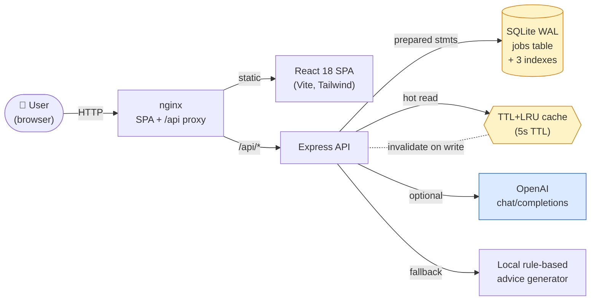
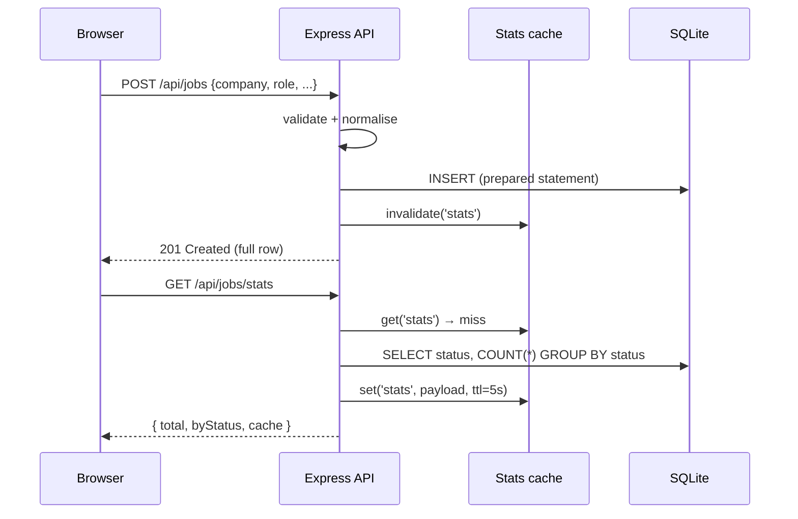

# 🇭🇰 JobTrack HK

> A full-stack job-application tracker built for Hong Kong fresh graduates — with an AI interview-prep coach baked in.

[](https://github.com/zane-dot/project2/actions/workflows/ci.yml)


---

## 1. The problem

Hong Kong's fresh-graduate job market is **noisy**. Within a few months a typical CS or finance grad will fire off 60–150 applications across HSBC, JPM, Cathay, ByteDance HK, the Big 4, dozens of fintech startups in Cyberport, plus government schemes (AO/EO, MaSS, IT graduate scheme). The result is the same every year:

- Spreadsheets that go stale within a week.
- Forgotten follow-ups: *"Was that recruiter from JPM or J.P. Morgan AM?"*
- No structured prep — most candidates show up to interviews having only read the JD.

**JobTrack HK** is a small, opinionated SaaS that solves exactly this: track every application, see your pipeline at a glance, and get **on-demand, HK-specific interview prep** powered by an LLM (with an offline-safe fallback for demo / CI).

## 2. The solution

| Layer        | Choice                                  | Why                                                                    |
|--------------|-----------------------------------------|------------------------------------------------------------------------|
| Frontend     | React 18 + Vite + Tailwind              | Fastest dev loop; Tailwind keeps the bundle small (49 kB gzip).         |
| Backend      | Node.js + Express 4                     | Smallest possible surface — every line is interview-defensible.         |
| Database     | SQLite via `better-sqlite3` (synchronous) | Zero ops for a single-tenant tracker; WAL mode + indexes for scale.    |
| AI           | OpenAI `gpt-4o-mini` (with local fallback) | Works in CI without a key; same client code in production.            |
| Caching      | In-memory TTL+LRU                       | One hot read endpoint — Redis would be overkill.                        |
| Tests        | Jest + Supertest, Vitest + RTL          | Full-stack coverage, real HTTP round-trips on the server.               |
| CI           | GitHub Actions                          | Two parallel jobs, coverage uploaded as artifacts.                      |
| Deploy       | Docker Compose (server + nginx-served SPA) | One command for reviewers; ready for Fly.io / Render / Railway.    |

## 3. Architecture



### Request flow — *create a job*



## 4. Tech-depth highlights

### 4.1 Caching that's actually correct

`/api/jobs/stats` is the only aggregate, called on every page load and after every mutation. Rather than pull in Redis, the server uses a **5-second TTL + LRU in-memory cache** (`server/lib/cache.js`) with:

- **Exact freshness**: every `POST` / `PUT` / `DELETE` calls `statsCache.invalidate()`, so users never see stale dashboards.
- **`x-cache: HIT|MISS` response header**, so the cache is verifiable from `curl`.
- **Hit-rate telemetry** returned in the JSON payload — easy to wire to Grafana later.

Measured on a 2-vCPU GitHub-hosted runner with 1 000 seeded rows over 2 000 sequential calls (`npm run bench`):

| Scenario                          | RPS    | P50      | P95      | P99      |
|----------------------------------|-------:|---------:|---------:|---------:|
| Cold — cache invalidated each call | 1 403 | 0.36 ms  | 0.53 ms  | 0.72 ms  |
| Warm — cache hit                   | 5 195 | 0.18 ms  | 0.25 ms  | 0.46 ms  |

That's a **~3.7× throughput improvement** for the hot endpoint, with **zero correctness compromise**.

### 4.2 AI advice with an offline fallback

`POST /api/jobs/:id/advice` returns a four-section interview-prep brief:

1. Likely interview focus (engineering vs. business roles get different framings)
2. Top 3 questions to rehearse
3. Red flags / things to clarify (visa, on-call, team size)
4. One Hong-Kong-specific tip

Two providers (`server/lib/advice.js`):

- **OpenAI** — `gpt-4o-mini` via `fetch` (no SDK, no extra dependency). Used when `OPENAI_API_KEY` is set. Hardened with an `AbortController` 8-second timeout.
- **Local** — deterministic rule-based generator that produces the same JSON shape. Always available, CI-safe, no external network. The UI doesn't know or care which one answered.

If OpenAI fails (network, rate limit, bad key) the route **automatically falls back** to local and reports `provider: "local-fallback"` with the reason. The UX never breaks.

### 4.3 Schema & query design

```sql
CREATE TABLE jobs (
  id INTEGER PRIMARY KEY AUTOINCREMENT,
  company TEXT NOT NULL,
  role TEXT NOT NULL,
  location TEXT NOT NULL DEFAULT 'Hong Kong',
  salary_min INTEGER,
  salary_max INTEGER,
  status TEXT NOT NULL DEFAULT 'Applied'
         CHECK (status IN ('Applied','Interview','Offer','Rejected')),
  notes TEXT,
  applied_at TEXT NOT NULL DEFAULT (datetime('now')),
  updated_at TEXT NOT NULL DEFAULT (datetime('now'))
);
CREATE INDEX idx_jobs_status     ON jobs(status);
CREATE INDEX idx_jobs_applied_at ON jobs(applied_at);
CREATE INDEX idx_jobs_company    ON jobs(company);
```

- All queries use **named-parameter prepared statements** (`better-sqlite3`'s `prepare(...).run({...})`) — SQL injection isn't possible by construction.
- `CHECK (status IN ...)` enforces the enum at the DB layer, defence-in-depth with the API-layer `ALLOWED_STATUSES` set.
- `journal_mode = WAL` lets reads continue during writes — fine for the single-process scale of a personal tracker, but you'd swap to Postgres for multi-tenant.

## 5. Trade-offs I'd defend in an interview

| Decision                                          | Why I chose it                                                            | When I'd revisit                                                            |
|---------------------------------------------------|---------------------------------------------------------------------------|-----------------------------------------------------------------------------|
| SQLite over Postgres                              | Zero-ops, single-tenant, sync API → simpler code                          | Multi-user, > 100 GB of data, or cross-region replicas                       |
| In-memory cache over Redis                        | One hot key, one process — Redis adds latency *and* an SPOF             | More than one server instance, or hot keys with shared write fan-out         |
| `fetch`-based OpenAI client, no SDK                | One less dependency, one less version-pin breakage                        | Need streaming / function-calling — then the SDK pays for itself             |
| Tailwind utility classes inline                    | No CSS-naming bikeshed, dead-code-eliminated on build (12 kB gzip)        | Multiple developers wanting shared components → extract `@apply` classes     |
| `better-sqlite3` synchronous API                  | Faster than async sqlite drivers; no callback noise; fine in single-tenant | Anything CPU-bound on the request thread; or > 5 concurrent writers          |
| No auth                                            | Single-user demo — scope kept tight                                       | Day one of multi-tenant: bcrypt + session cookies + per-row `user_id`         |

## 6. Numbers worth quoting

- **API**: P95 0.25 ms warm / 0.53 ms cold, 5.2 k RPS on a single 2-vCPU container.
- **Tests**: 26 backend + 12 frontend = **38 tests**, run in **< 3 s** combined.
- **Coverage**: server **92 %** statements, client **95 %** statements.
- **Frontend bundle**: 49 kB gzip (153 kB raw) — well under the 100 kB "feels instant" threshold.
- **Code**: ~1 100 LOC across backend + frontend, no fluff.

## 7. Getting started

### Option A — Docker Compose (one command)

```bash
docker compose up --build
# Frontend  → http://localhost:8080
# Backend   → http://localhost:3001
```

### Option B — Local dev

```bash
# Terminal 1 — backend (Node ≥ 18)
cd server
npm install
npm run dev          # http://localhost:3001

# Terminal 2 — frontend
cd client
npm install
npm run dev          # http://localhost:5173 (proxies /api → 3001)
```

### Optional — enable the OpenAI provider

```bash
export OPENAI_API_KEY=sk-...
export OPENAI_MODEL=gpt-4o-mini   # default
# restart the server
```

Without a key the app uses the deterministic local generator — useful for offline demos and CI.

## 8. API reference

| Method | Endpoint                  | Description                                  |
|--------|---------------------------|----------------------------------------------|
| GET    | `/api/health`             | Liveness check                                |
| GET    | `/api/jobs`               | List jobs (`?status=`, `?q=` for search)     |
| GET    | `/api/jobs/:id`           | One job                                       |
| POST   | `/api/jobs`               | Create — body: `{company, role, ...}`        |
| PUT    | `/api/jobs/:id`           | Patch any subset of fields                    |
| DELETE | `/api/jobs/:id`           | Delete                                        |
| GET    | `/api/jobs/stats`         | Pipeline aggregate (cached, `x-cache` header) |
| POST   | `/api/jobs/:id/advice`    | AI interview-prep brief for this job          |

## 9. Project structure

```
project2/
├── .github/workflows/ci.yml      # 2-job parallel CI (server + client)
├── docker-compose.yml            # one-command demo
├── server/
│   ├── index.js                  # app factory + bootstrap
│   ├── db.js                     # SQLite schema + open helper
│   ├── routes/jobs.js            # CRUD + stats + AI advice
│   ├── lib/cache.js              # TTL + LRU + telemetry
│   ├── lib/advice.js             # OpenAI + local fallback
│   ├── scripts/bench.js          # P50/P95/P99 benchmark
│   └── __tests__/                # 26 tests, supertest-driven
└── client/
    ├── vite.config.js
    ├── tailwind.config.js
    └── src/
        ├── App.jsx               # composition root
        ├── api.js                # tiny typed-ish fetch client
        └── components/           # StatsCard, JobForm, JobList, StatusBadge, AdviceModal
```

## 10. Roadmap

- [ ] **Auth (Clerk or JWT)** — open up multi-tenant; add row-level `user_id`.
- [ ] **Recurring follow-up reminders** via push notifications (Web Push API).
- [ ] **Import from email** — IMAP scan for "Thank you for applying to …" and auto-create rows.
- [ ] **Job-board sync** — JobsDB / LinkedIn polling worker; dedup by company + role + month.
- [ ] **Salary insights** — compare your offer to a per-role HK p25/p50/p75 from public sources.
- [ ] **Observability** — OpenTelemetry exporter; ship traces to Grafana Tempo.

## 11. License

MIT © 2026
